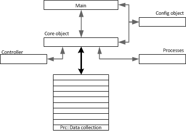
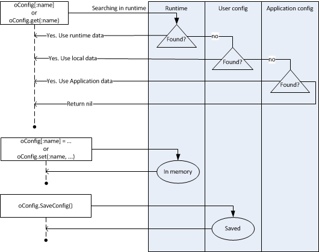
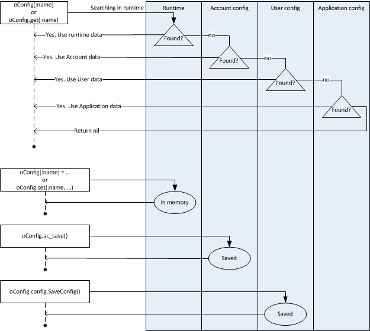

lorj framework model
====================

The framework is built over several pieces:

* Main

  This is your main ruby code.

* Core framework (core object) + Lorj::Data collection

  This object is the central system which implements controller/processes execution.

* Configuration object (config object)

  A configuration management object to serves processes on external data and adapt behaviors.

* 1 or more processes

  A process requires to define at least one `Lorj::Data` object type and data structure. This object will be mapped with data managed by the controller object.

  It defines how to `create`, `get`, `query`, `update` or `delete` one `Lorj::Data` type

* 1 controller object

  It defines functions to do what the requires the controller to do, like creating a server on hpcloud, or openstack, or even a container on docker.

Config object
-------------

lorj defines 2 different objects to provide configuration data management. But you can define your own config object as soon as you respect the API used by the framework.

* Lorj::Config

  This class implements a key/value system which can be predefined (default values) and structured. It uses at least one application file definition, an optional user config file and a runtime config.

  * Application configuration data file.

    This file is written in `yaml`. It is structured as collection of key/value pair per sections.

    Usually stored in your application path, a `defaults.yaml` file will describe config structure definition (section **:section:**) and application default values (section **:default:**).

    See `Application config file : defaults.yaml`_ for details.

  * User configuration data file.

    This optional file is written in `yaml`. It is structured as collection of key/value pair per sections.

    This file is used to redefine some application defaults (section :default:) or add user key/value pair.

  * runtime data.

    At runtime, you application can define any kind of key/value pair. There is no notion of section here. But you can redefine a default value set from the `User configuration data file` or from the `application configuration data file.`

Short summary about Config `get`, `set` and `save`

* Lorj::Account

  This object uses Lorj::Config object to add 1 additionnal level of files to get/set data.

  * Account configuration data file.

    This file is written in `yaml`. It is structured as collection of key/value pair per sections.

    The content of file respects data structure defined in the `defaults.yaml` application file.
    Usually, the file is saved with

Short summary about Account `get`, `set` and `save`.

###Application config file : defaults.yaml

This file stored in your application directories defines 2 main sections:

* `:default:`

  This section contains a collection of key/values predefined for the application.
  all those key/value pairs can be redefined in the user config

* `:section:`

  This section is used to define config.yaml valid structure and data structure used by `Lorj::Account`

###User config file : config.yaml

* `:default:`

  This section contains a collection of key/values. It redefines application data if exists.

* `:any kind of section`

  This section contains a collection of key/values. No references from application.

License:
========
lorj is licensed under the Apache License, Version 2.0.  See LICENSE for full license text.
